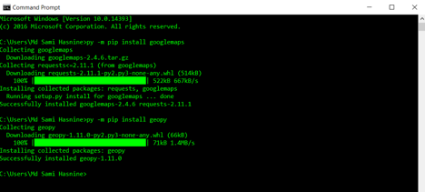

# Instruction Manual TILOS

1.	First, you need to have a google account. Then you need to find the directional API key from you google account. This key will work as an ID in the google API platform. 
2.	Open the python 3.6 version from your program menu. 
3.	Then go to file to select the python code you would like to run.
4.	Once you load the python code, you need to change in three places. 
* Google API Key, 
* Location of the directory 
* Name of the input file

6. Some times google app may not be installed in your computer. In that situation try to run following code in command line interface (commad promt) 
> pip install googlemaps && pip install geopy
6. Once the program is finished, try to open it in Notepad++ and then copy in Excel. Alternatively, you can just open 

